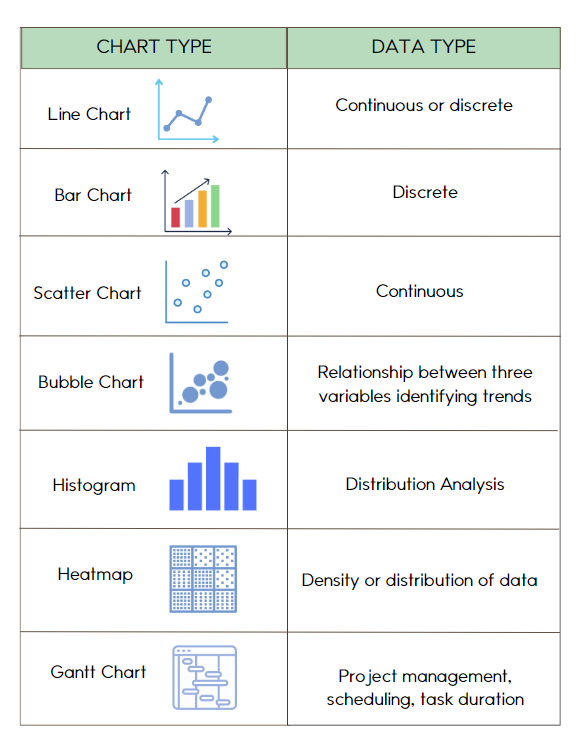

# An Beginners Guide to Visualising Data with ggplot2

Data visualisation is one of the most useful skills to have as a novice data scientist like yourself. Whether you're creating bar charts for a future consultancy or illustrating ongoing geopolitical changes for a news agency; what you will learn in this tutorial can be translated into any field, as long as there's data!

------------------------------------------------------------------------

## Tutorial Plan:

1.  Familiarising ourselves with ggplot2

2.  Start practicing with ggplot2 to make:

    a)  Scatter Plots

    b)  Scatter Plots with Multiple Variables

    c)  Bar Charts

    d)  Pie Charts

    e)  Panel of all our plots

3.  Exercises

**In this tutorial we will mainly be working with native R data sets which can be accessed [here](https://stat.ethz.ch/R-manual/R-devel/library/datasets/html/00Index.html). The only external data set we use is the student performances data set, which is open access and can be downloaded [here](https://www.kaggle.com/datasets/muhammadroshaanriaz/students-performance-dataset-cleaned). Student performances will need to imported like any generic .csv file. Any of the native R data sets do not need to be downloaded. Instead you can simply type `data(data_name)` in the console to load it.**

------------------------------------------------------------------------

## Familiarising ourselves with ggplot2

### Cheat-sheet for ggplot2:

You can refer to the following cheat-sheets when making your plots. These provide a useful breakdown of the grammar of graphics, as well as various customisation options.


------------------------------------------------------------------------

### Different Charts and Their Purposes:



ggplot2 is part of the tidyverse package and is a great tool used by many data scientists to visually map-out findings from the data. You might find that plotting is not difficult once you're comfortable with the basics, as it is built on a set *grammar of graphics* (think of this like a template). The grammar, as you will see, stays the same, and the options to customise your plots are endless. Let us dive right in to see how this works.

------------------------------------------------------------------------

## Start practicing with ggplot2

### Scatter Plots

Open up RStudio and pull-up a new script. You can either select `file>new file>R script`, or you can simply press `cntrl+shift+n`. You will then load/install the tidyverse and gridExtra libraries as shown below.


``` r
# script title
# your name and the date

# load the needed libraries. If you haven't used them before, don't forget to install.packages("packagename"). 
library(tidyverse)
```

```
## ── Attaching core tidyverse packages ──────────────────────── tidyverse 2.0.0 ──
## ✔ dplyr     1.1.4     ✔ readr     2.1.5
## ✔ forcats   1.0.0     ✔ stringr   1.5.1
## ✔ ggplot2   3.5.1     ✔ tibble    3.2.1
## ✔ lubridate 1.9.3     ✔ tidyr     1.3.1
## ✔ purrr     1.0.2     
## ── Conflicts ────────────────────────────────────────── tidyverse_conflicts() ──
## ✖ dplyr::filter() masks stats::filter()
## ✖ dplyr::lag()    masks stats::lag()
## ℹ Use the conflicted package (<http://conflicted.r-lib.org/>) to force all conflicts to become errors
```

``` r
library(gridExtra)
```

```
## 
## Attaching package: 'gridExtra'
## 
## The following object is masked from 'package:dplyr':
## 
##     combine
```

Now we need to import the data and inspect it:


``` r
# import the data
data("Orange")

# inspect the data, you can simply click on the subset if you want to view the whole data set
head(Orange)
```

```
##   Tree  age circumference
## 1    1  118            30
## 2    1  484            58
## 3    1  664            87
## 4    1 1004           115
## 5    1 1231           120
## 6    1 1372           142
```

``` r
View(Orange)
```

You can use the `head()` function like the code above shows, but usually I prefer to just use `View()`. That way you can scroll through the data and get a better overview, but it really comes down to whatever you are comfortable with. Generally, however, larger data sets are hard to navigate with just `View()` alone.

Either way, there is some pretty interesting data here. As you can see, the data shows information on orange trees' age and circumference. Let us start with something simple; we want to find the correlation between age and circumference of trees. One would assume the circumference increases with age, right? Let us take a look; the data is already tidy, so we do not have to do much wrangling just yet. First let us make the plot, then we will break it down line by line to better understand what the code is doing.


``` r
# make a scatter plot to show the correlation between age and circumference
ggplot(Orange, aes(x = age, y = circumference)) +
  geom_point() +
  labs(title = "Corrolation Between Orange Tree Age and Circumference") +
  xlab("Age of Tree (days)") +
  ylab("Trunk Circumference (mm)") +
  scale_colour_gradient(low = "blue", high = "red") +
  theme_bw()
```


Great, there is our first plot! As you can see, our assumption was right, trunk circumference does indeed increase with age.

Now we will break down the plotting grammar to see what each specific line does. This way, you will be able to adopt this grammar structure to any other visualisation project you put your mind to.

------------------------------------------------------------------------

### Breaking Down the Code

ggplot2 works by stacking multiple lines of code on top of each other, each line thereby adds an aesthetic value to the plot. The first line identifies the data and the axes, `aes()` defines any variations you want to include in your plot. We can add a `+` sign to the end to build our next line of code. Note that `aes` stands for aesthethic – this will help you remember what it does. Essentially, the structure always follows as: `ggplot(dataframe_name, aes( x, y))` with `x, y` being your axes.


``` r
# orange is the data set we're working with
# age is assigned to the x axis
# circumference is assigned to the y axis
# geom_point() used to sepcify we want a scatter plot
ggplot(Orange, aes(x = age, y = circumference)) +
  geom_point()
```

Here we tell ggplot2 what kind of plot we want to make. If you want, go back to the top and look at the cheat-sheet; we chose to make a scatter plot, hence the `geom_point()` call.

Next, we can add titles with the `labs()` function, we can use `xlabs()` and `ylabs()` to label our axes as well:


``` r
# add a title to your plot
# specify axis labels
ggplot(Orange, aes(x = age, y = circumference)) +
  geom_point() +
  labs(title = "Corrolation Between Orange Tree Age and Circumference") +
  xlab("Age of Tree (days)") +
  ylab("Trunk Circumference (mm)")
```

<!-- -->

Notice how we are essentially "stacking" code on top of each other. We can further customise this plot by adding another layer to the grammar of graphics. As you remember, each function gets stacked on top of the other with a `+` symbol. So, we can add some colour – let us try a gradient by typing `scale_colour_gradient()`. We will also have to define that the colouring should be dictated by circumference in the `aes()` brackets; let us see how this works:


``` r
# first, define what your colours indicate in the aesthetics
# then, define your colour gradient by addeding another layer to the code
ggplot(Orange, aes(x = age, y = circumference, colour = circumference)) +
  geom_point() +
  labs(title = "Corrolation Between Orange Tree Age and Circumference") +
  xlab("Age of Tree (days)") +
  ylab("Trunk Circumference (mm)") +
  scale_colour_gradient(low = "blue", high = "red")
```

<!-- -->

> ***NOTE:*** You can access the link [here](https://www.datanovia.com/en/blog/ggplot-gradient-color/). You will find that there is another alternative to further customise gradient colour options that will result in your plot looking slightly different than mine; feel free to try the other option as well!

The `scale_colour_gradient()` allows you to seamlessly illustrate variation through colour. There are many ways to define colours. If not working with a gradient, you can simply use `scale_fill_manual()`, which allows you to manually define colours. There are many other options to colour your plots, but for the purpose of this first graph, a simple gradient will suffice. Do not worry, we will explore other options in the next examples. First let us cover the final layer of our code; as you can guess, it defines the theme of the plot. There are various default themes that come with ggplot2. For simple visualisation, I like to use `theme_bw()`. We will explore other themes in the next plots.


``` r
# define your theme
ggplot(Orange, aes(x = age, y = circumference, colour = circumference)) +
  geom_point() +
  labs(title = "Corrolation Between Orange Tree Age and Circumference") +
  xlab("Age of Tree (days)") +
  ylab("Trunk Circumference (mm)") +
  scale_colour_gradient(low = "blue", high = "red") +
  theme_bw()
```

<!-- -->

------------------------------------------------------------------------

### Scatter Plots with Multiple Variables

Let us now try to make a slightly more complicated plot. We will use the student performances data set here to explore how to add more variables to your scatter plots.

Go to the following [link](https://www.kaggle.com/datasets/muhammadroshaanriaz/students-performance-dataset-cleaned) and download the student performances data set. You will first need to import and inspect the data.


``` r
# import the data set either with read.csv or by clickiung import dataset in your environmnet pane.
student_performances <- read.csv("Cleaned_Students_Performance.csv")

# examine the data set
head(student_performances)
```

```
##   gender race_ethnicity parental_level_of_education lunch
## 1      0        group B           bachelor's degree     1
## 2      0        group C                some college     1
## 3      0        group B             master's degree     1
## 4      1        group A          associate's degree     0
## 5      1        group C                some college     1
## 6      0        group B          associate's degree     1
##   test_preparation_course math_score reading_score writing_score total_score
## 1                       0         72            72            74         218
## 2                       1         69            90            88         247
## 3                       0         90            95            93         278
## 4                       0         47            57            44         148
## 5                       0         76            78            75         229
## 6                       0         71            83            78         232
##   average_score
## 1      72.66667
## 2      82.33333
## 3      92.66667
## 4      49.33333
## 5      76.33333
## 6      77.33333
```

``` r
View(student_performances)
```

We can see that the data contains information on students test scores, as well as info such as gender, race, lunch, test preparation, etc.

Notice that we need to transform the data a bit before working with it. As you may notice, we have binary values (0, 1) as observations under some of our columns, let us change these to more interpretable words. For example, we can change gender observations from binary values to "male" and "female", or lunch observations to "yes" or "no". We will need to use the `factor()` function as we're converting numeric values into categorical variables:


``` r
# first fix the gender column
student_performances$gender <- factor(student_performances$gender, levels = c(0, 1), labels = c("Female", "Male"))

# next, do the same for the test preparation column
student_performances$test_preparation_course <- factor(student_performances$test_preparation_course, levels = c(0, 1), labels = c("No", "Yes"))

# and for the lunch column
student_performances$lunch <- factor(student_performances$lunch, levels = c(0, 1), labels = c("No", "Yes"))
```

Great! Now your columns should be fixed. Now let us make a plot to show the correlation between math and reading scores. We would assume that, generally speaking, students who score high on one subject would also score high in another. We also want to include gender and lunch data, which we can do by specifying the colour of the dots for gender and the shape of the dots for lunch. Here is how the code for this would look:


``` r
# assign reading_score to the x-axis, math_score to the y-axis
# indicate that colour is dependent on gender
# indicate that shape is dependent on lunch
ggplot(student_performances, aes(x = reading_score, y = math_score, colour = gender, shape = lunch)) + 
  geom_point() +
  labs(title = "Corrolation Between Maths and Reading Scores") +
  xlab("Reading Score") + 
  ylab("Math Score") +
  theme_light()
```

<!-- -->

Cool right? We can see that students generally scored high on reading if they scored high in math, and vice versa. We can also see the gender and lunch data of each observation, neat!

> ***NOTE:*** There are plenty of ways you can customise the shapes, sizes and even colours of the points in your scatter plot. [Here](https://www.sthda.com/english/wiki/ggplot2-point-shapes) is a link where you can view further customisation options.

------------------------------------------------------------------------

### Bar Charts

Now let us try to make something a little different. We will use the iris data set, which is another phenomenal native R data set you can experiment with when you are just starting out. The data set consists of measurements of three different species belonging to the iris plant. Load and take a look at the data:


``` r
# load iris data
data("iris")

# inspect the data
View(iris)
```

As you can see, each species contains four variables: petal length, petal width, sepal length, and sepal width. We will start with something simple by making a bar chart to illustrate the average length of each species respectively. To do this we first need to group together our species and calculate the average petal length of each. We can do this with the dplyr package from tidyverse:


``` r
petal_length_by_species <- iris %>% 
  group_by(Species) %>% 
  summarise(petal_length_by_species = mean(Petal.Length))
```

Great, now we just have to plot! This process is quite similar, with only a few minor adjustments that we will explain in detail next.

When making bar charts we use `geom_bar` instead of `geom_point`. We will also try a different theme just to see what it looks like:


``` r
# make a bar chart using geom_bar()
# try a different theme
ggplot(petal_length_by_species, aes(x = Species, y = petal_length_by_species, fill = Species)) +
  geom_bar(stat = "identity") +
  labs(title = "Average Petal Length for Each Species") +
  xlab("Species") +
  ylab("Average Petal Length (cm)") +
  theme_classic()
```

<!-- -->

Notice how we put `stat = "identity"` inside `geom_bar()`. This is because we are indicating that our y-values (i.e. the height of our bars relative to the y axis) have already been produced when we calculated the average petal length with `summarise(petal_length_by_species = mean(Petal.Length))`. If we leave the inside of the brackets blank, R would start counting the number of observations instead.

> ***NOTE:*** You can learn more about the role of `stat = "identity"` [here](https://stackoverflow.com/questions/59008974/why-is-stat-identity-necessary-in-geom-bar-in-ggplot).

Regardless, we can see that the Virginica species has the largest average petal length.

------------------------------------------------------------------------

### Pie Charts

Since we have learned how to make bar plots, let us make a pie charts next. You will notice that making a bar plot is essentially part of the pie chart process.

> ***NOTE:*** You can refer to the following link [here](https://r-charts.com/part-whole/pie-chart-ggplot2/?utm_content=cmp-true) for further details on making pie charts with ggplot2.

Once again we will work with a different data set, as we need categorical variables and prefer to work with ecological data (we are ecologists after all). We will work with another native R data set called `ChickWeight`; this gives you a chance to familiarise with other data sets as well. As already mentioned, there are a plethora of native data sets for R, which you can use to experiment in your free time and start building a portfolio.

Regardless, we can see that we have a categorical variable (diet) in our data. We want to see the how many chicks are on which diets. To do this we will need to calculate how many chicks had each unique diet and calculate their proportional value as percentages:


``` r
# count how many chicks are on each diet
# then calculate the percentage 
diets <- ChickWeight %>% 
  count(Diet) %>% 
  mutate(percentage = n / sum(n) * 100)
```

Cool, now you should see in your environment the count and respective percentage of chicks for each diet. Looks like diet number 1 is the most popular; let us visualise this on a pie chart. Here you will see how making a bar chart is part of the process for making a pie chart. We will illustrate this even better once the pie chart is finished by converting it back into a bar chart, but first, let us make a pie:


``` r
# make a pie chart using the geom_bar() function
# transform into pie chart with coord_polar()
ggplot(diets, aes(x = "", y = percentage, fill = Diet)) +
  geom_bar(stat = "identity", width = 1) +
  coord_polar(theta = "y") +
  labs(title = "Percentage of Chicks by Diet")
```

<!-- -->

Here we have a couple of things to keep in mind or that may appear new to you:

1- We do not define an x axis in the `aes()` brackets, since pie charts are based on y-values and we are not assigning any categorical values to the x axis. Leaving the `x = ""` section that way informs ggplot2 that we are not treating individual groups, but rather showing proportions relative to the overall `count()` of diets.

2- `coord_polar(theta = "y")` is used to transform a rectangular coordinate system (which is normal Cartesian) to a circular system (also referred to as polar). Specifying `theta = "y"` thereby informs ggplot2 to use the y-values as representations for the portions of the pie.

3- Another thing to keep in mind is to include `width = 1` in your `geom_bar` call, otherwise the plot won't exactly be a pie chart in the traditional sense. We will cover this in more detail in the next plot.

Either way, there is your first pie chart. It is a bit cluttered if you ask me, let us further customise it to make it more legible. For one, we can get rid of the axes around the pie. Another thing we can try is working with Brewer Palettes. This enables a more appealing colour selection, which make the plot easier on the eyes. Remember, **always make sure the charts are easy to interpret**.

> ***NOTE:*** A simple trick to findings distinguishable colour palettes is to use Brewer palettes. These are integrated R packages by Cynthia A. Brewer, you can read more about Brewer Packages [here](https://jmsallan.netlify.app/blog/the-brewer-palettes/).

Let us now make some changes to our first pie chart to make it more appealing.


``` r
# use theme_void() to remove the axes
# indicate the Brewer palette with scale_fill_brewer()
# convert the pie into a donut
# add percentage labels rounded up to one decimal point
ggplot(diets, aes(x = 2, y = percentage, fill = Diet)) +
  geom_bar(stat = "identity", width = 1) +
  coord_polar(theta = "y", start = 0) +
  labs(title = "Percentage of Chicks by Diet") +
  geom_text(aes(label = paste0(round(percentage, 1), "%")),
            position = position_stack(vjust = 0.5)) +
  scale_fill_brewer(palette = "Blues") +
  theme_void() +
  xlim(0.5, 2.5)
```

<!-- -->

Much better, the colours are clearly distinguishable and the minimalist design reduces clutter. Bear in mind that a significant part of your initial plots will involve lots of trial and error. Even if your grammar is correct, you may not immediately get the result you envisioned on your first try. However, adding additional layers will help you achieve your desired results.

> ***NOTE:*** In these instances googling your troubleshooting questions will come in handy, you might even learn something new. I referred to the following links accessible [here](https://www.datanovia.com/en/blog/how-to-create-a-pie-chart-in-r-using-ggplot2/), [here](https://r-charts.com/part-whole/pie-chart-ggplot2/) and [here](https://stackoverflow.com/questions/47752037/pie-chart-with-ggplot2-with-specific-order-and-percentage-annotations/47752581) as a guide to making pie charts, specifically in helping with converting the pie into a donut and adding percentage labels.

Note that we can essentially express the same data in the form of a stacked bar chart. This is because the overall height of the bar (y-value) is equal to 100%, wherefore each proportion within the bar represents a percentage share. Let us see how this would look, we will also try a different palette and theme:


``` r
# convert the pie into a stacked bar plot with a different colour palette and theme
ggplot(diets, aes(x = "", y = percentage, fill = Diet)) +
  geom_bar(stat = "identity", width = 1) +
  labs(title = "Percentage of Chicks by Diet Type") +
  theme_classic() +
  scale_fill_brewer(palette = "Reds") +
  theme(axis.text.x = element_blank(),
        axis.title.x = element_blank()) +
  geom_text(aes(label = paste0(round(percentage, 1), "%")),
            position = position_stack(vjust = 0.5))
```

<!-- -->

As you can see, the same data that was being represented by the donut chart is now being represented in the form of a stacked bar chart.

------------------------------------------------------------------------

### Making a Panel

Panels are good if you want to compile multiple plots. To make a panel we will need to use gridExtra, which we loaded at the start of the tutorial. If you forgot to do this, make sure to install/load it now:


``` r
#install if you haven't already
install.packages("gridExtra")
```

```
## Warning: package 'gridExtra' is in use and will not be installed
```

``` r
#load it once you have it installed
library(gridExtra)
```

Great, now we can specify which plots we want to include in our panel using the `grid.arrange()` function. At this point we need to assign our plots; you can simply save your plots in your environment. To do this you need to copy your ggplot code and assign it the following way – we will start with the "tree trunk circumference" plot to demonstrate:


``` r
# save your plots to your environment
# starting with scatter plot
plot1 <- ggplot(Orange, aes(x = age, y = circumference, colour = circumference)) +
  geom_point() +
  labs(title = "Age/Trunk Circumference Correlation") +
  xlab("Age of Tree (days)") +
  ylab("Trunk Circumference (mm)") +
  scale_colour_gradient(low = "blue", high = "red") +
  theme_bw()
```

You can see that `plot1` is now saved to your environment. Now let us do this for our other plots as well. We will use the lunch data plot, the blue pie chart and the scatter plot:


``` r
# then save the bar chart
plot2 <- ggplot(petal_length_by_species, aes(x = Species, y = petal_length_by_species, fill = Species)) +
  geom_bar(stat = "identity") +
  labs(title = "Average Petal Length for Each Species") +
  xlab("Species") +
  ylab("Average Petal Length (cm)") +
  theme_classic()

# then the donut chart
plot3 <- ggplot(diets, aes(x = 2, y = percentage, fill = Diet)) +
  geom_bar(stat = "identity", width = 1) +
  coord_polar(theta = "y", start = 0) +
  labs(title = "Percentage of Chicks by Diet") +
  geom_text(aes(label = paste0(round(percentage, 1), "%")),
            position = position_stack(vjust = 0.5)) +
  scale_fill_brewer(palette = "Blues") +
  theme_void() +
  xlim(0.5, 2.5)

# and lastly add the stacked bar chart
plot4 <- ggplot(diets, aes(x = "", y = percentage, fill = Diet)) +
  geom_bar(stat = "identity", width = 1) +
  labs(title = "Percentage of Chicks by Diet") +
  theme_classic() +
  scale_fill_brewer(palette = "Reds") +
  theme(axis.text.x = element_blank(),
        axis.title.x = element_blank()) +
  geom_text(aes(label = paste0(round(percentage, 1), "%")),
            position = position_stack(vjust = 0.5))
```

Now that everything is in your environment, all we need to do is create the actual panel. We do this with the `grid.arrange()` function. You can specify the structure of your panel with `ncol` within your `grid.arrange()` function. Since we have four plots, a panel with two columns should work nicely.


``` r
# make a pannel and specify the column number with "ncol"
grid.arrange(plot1, plot2, plot3, plot4, ncol = 2)
```

<!-- -->

Congrats, you have successfully made 4 different plots; you are a natural! Panels are useful in this sense to compile your plots to present your various findings in a single graph. One thing to note is that your plots can very easily get cluttered in this process. Try replacing the first plot of our panel (trunk circumference scatter plot) with the student performances plot:


``` r
plot1.2 <- ggplot(student_performances, aes(x = reading_score, y = math_score, colour = gender, shape = lunch)) + 
  geom_point() +
  labs(title = "Corrolation Between Maths and Reading Scores") +
  xlab("Reading Score") + 
  ylab("Math Score") +
  theme_light()

# then save the bar chart
plot2.2 <- ggplot(petal_length_by_species, aes(x = Species, y = petal_length_by_species, fill = Species)) +
  geom_bar(stat = "identity") +
  labs(title = "Average Petal Length for Each Species") +
  xlab("Species") +
  ylab("Average Petal Length (cm)") +
  theme_classic()

# then the donut chart
plot3.2 <- ggplot(diets, aes(x = 2, y = percentage, fill = Diet)) +
  geom_bar(stat = "identity", width = 1) +
  coord_polar(theta = "y", start = 0) +
  labs(title = "Percentage of Chicks by Diet") +
  geom_text(aes(label = paste0(round(percentage, 1), "%")),
            position = position_stack(vjust = 0.5)) +
  scale_fill_brewer(palette = "Blues") +
  theme_void() +
  xlim(0.5, 2.5)

# and lastly add the stacked bar chart
plot4.2 <- ggplot(diets, aes(x = "", y = percentage, fill = Diet)) +
  geom_bar(stat = "identity", width = 1) +
  labs(title = "Percentage of Chicks by Diet") +
  theme_classic() +
  scale_fill_brewer(palette = "Reds") +
  theme(axis.text.x = element_blank(),
        axis.title.x = element_blank()) +
  geom_text(aes(label = paste0(round(percentage, 1), "%")),
            position = position_stack(vjust = 0.5))

# make a pannel and specify the column number with "ncol"
grid.arrange(plot1.2, plot2.2, plot3.2, plot4.2, ncol = 2)
```

<!-- -->

As you can see, this scatter plot becomes difficult to interpret as the plots translate poorly when reformatted to a smaller scale. You might similarly risk cutting-off plot titles that are too long as well. To avoid this I not only had to replace the first plot with the simpler trunk circumference plot, but I also had to change the title to make sure it was short enough to be fully included.

Regardless, it is now time for you to challenge yourself. Have a go at the following exercises below.

------------------------------------------------------------------------

### Exercises

1- What goes into the `aes()` brackets?

2- What is the relation between a stacked bar chart and a pie chart?

3- Where would you the title of a plot specified?

4- Do you have to rename columns before plotting, or can you specify the labels another way?

5- How do you remove a title and/or label from your plot?

6- What is the purpose of a panel and which library do we need to make one?

------------------------------------------------------------------------

### Wrap-up

In this tutorial we have covered how to make:

1.  Scatter Plots

2.  Advanced Scatter Plots

3.  Bar charts

4.  Pie and Donut Charts

5.  A panel of all our plots

You hopefully familiarised yourself with the grammar of graphics and understand the basics of cumstomisation. If you want to explore plotting further, the following [tutorial](https://r4ds.had.co.nz/data-visualisation.html) is incredibly useful.
